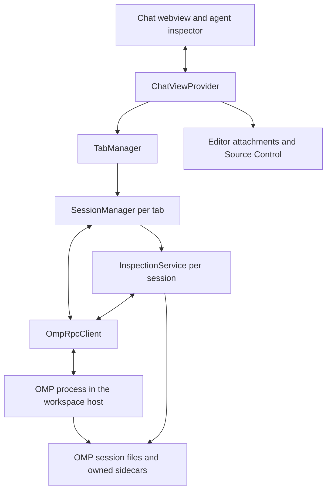

# OMPilot architecture

OMPilot connects a Cursor/VS Code workspace extension host to the user's installed Oh My Pi process. The intended Windows setup runs that host in WSL, so OMP uses the same Linux environment and provider configuration as the terminal CLI.

## Components

| Component | Responsibility |
| --- | --- |
| `src/extension.ts` | Commands, workspace state, and webview registration |
| `src/chat/chatViewProvider.ts` | Host/webview messages, editor actions, and attachment entry points |
| `src/omp/tabManager.ts` | Active tab, one session per tab, persisted open session IDs |
| `src/omp/sessionManager.ts` | Primary transcript, prompt queue, main steering, stopping, and interactive questions |
| `src/omp/rpcClient.ts`, `rpcFrames.ts` | Process lifetime, correlated RPC requests, protocol negotiation, and chunk decoding |
| `src/omp/inspectionService.ts` | Worker roster, transcript cursors, live worker snapshots, owned saved transcripts, and advisor discovery |
| `media/chat.js`, `agents.js` | Main conversation and inspector rendering, with shared webview messaging and markdown rendering |

## Transport and turns

Each tab launches `omp --mode rpc-ui --cwd <workspace>`. Optional extension settings add model, thinking, approval, resume, and other CLI flags. OMPilot uses OMP's normal environment and leaves its stored provider settings and credentials in place.

The transport is newline-delimited JSON over stdin/stdout. The client negotiates protocol v2 when available, correlates requests by string IDs, and opts into structured `ask` dialogs. Older runtimes can retain ordinary choice/text dialogs when they do not support that opt-in. Protocol-v2 chunk frames allow large logical outputs within the decoder's 64 MiB limit; individual physical frames remain bounded at 1 MiB.

The primary conversation renders assistant snapshots and deltas, tool execution events, command output, and notices. Tool arguments and results are retained without preview truncation. Thinking is shown only when supplied by the provider. Main steering uses OMP's `steer` command and records accepted directions in the displayed conversation. Ordinary sends made during an active turn enter the host's follow-up queue.

Completion follows `session_settled`, with `get_state` checks for compatibility and stop recovery. A non-terminal `agent_end` or pending background work keeps the session busy. Queued follow-ups wait for that settlement rather than a fixed stop delay. Process disposal closes stdin and has bounded termination fallbacks.

## Workers, advisors, and workflows

The inspector subscribes to subagent events and polls the roster. Selection fetches incremental `get_subagent_messages` results using byte cursors; live message snapshots bridge the interval before finalized messages appear in persisted transcripts. Transcript reset responses replace the cached contents. Worker controls target the selected subagent ID and are allowed only for workers reported as active.

Worker and advisor controls are scoped to the active chat tab. Switching tabs changes the inspector state and keeps worker steering drafts with their own chat. A stale inspector action or snapshot cannot redirect a worker control to another tab.

After resume, OMP's live worker registry may be empty. The inspector can discover valid saved workers and advisor sidecars beneath the primary session's own artifact directory. Disk fallback verifies the file's real directory and session header before reading it. Recorded workers have transcript access without live steering/cancellation controls. Advisors are read-only conversations, not messageable workers.

Advisor controls issue OMP's `/advisor on`, `/advisor off`, and `/advisor status` commands. **Arm prewalk** issues `/prewalk`. OMP owns the workflow configuration and handoff behavior; the host displays notices and refreshes model identity when OMP reports a change. Workflow controls send exact commands without consuming composer attachments.

Interactive confirmations, selects, inputs, editor dialogs, and structured `ask` questions map to `extension_ui_request` / `extension_ui_response`. The host validates structured answers against question IDs and option labels. OMP remains responsible for tool approval policy.

## Persistence and editor context

Open session IDs, titles, and active-tab position are stored in workspace state. Starting a restored tab resumes its exact OMP session ID. The primary transcript is fetched through paged history where supported, with a session-file fallback. Worker and advisor transcripts are fetched separately. A restored transcript does not restore a running process or make a finished worker steerable.

Saved file/folder/image attachments use OMP file mentions. Selections, terminal output, and dirty editor buffers are embedded as text context. Dirty current-file/open-editor autocomplete entries use the attachment path so they carry unsaved buffer contents. This is a snapshot at attachment time. Filesystem tools still read and modify saved files; attaching a buffer does not save it.

File references from tool arguments support editor navigation. **Review changes** opens SCM to inspect the working tree. OMPilot does not implement native Cursor checkpoints or a per-turn revert store.

Ask adds instructions to answer with read tools and avoid changes; Plan adds instructions to investigate and propose an implementation plan without changes. Agent adds no mode hint, and slash commands bypass the hints. These instructions do not disable tools, enforce read-only access, or provide a security sandbox. Approval-related extension settings become explicit CLI overrides for the launched OMP process; the underlying configuration file is not rewritten.

## Verification boundary

The integration was exercised against real OMP **18.4.10** in WSL using newly created smoke sessions. Coverage includes RPC readiness and negotiation, worker steering and complete transcripts, targeted cancellation acknowledgement/lifecycle, saved worker and advisor restoration, primary session resume, structured questions, tool approval, and prewalk model handoff. Host and webview DOM tests cover rendering, raw-message preservation, tab scoping, questions, and turn lifecycle. Nested worker restoration was not exercised in the live smoke run.

Live scripts are `scripts/smoke-omp.ts` and `tests/live-omp-backend.ts`. They require a configured OMP runtime and consume provider requests. The regular test command uses fixtures and DOM tests.

OMPilot is a separate extension panel. The native Cursor window and remote installation flow were not visually verified during this build. The supported bridge does not replace Cursor's built-in Agent runtime or share its conversation/checkpoint state.

## Provenance

[javad-alipanah/ompilot](https://github.com/javad-alipanah/ompilot) is based on [Chakyiu/omp-vscode](https://github.com/Chakyiu/omp-vscode). The upstream [MIT license](../LICENSE) and contributor attribution are retained.
